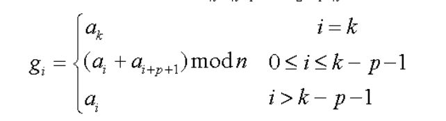
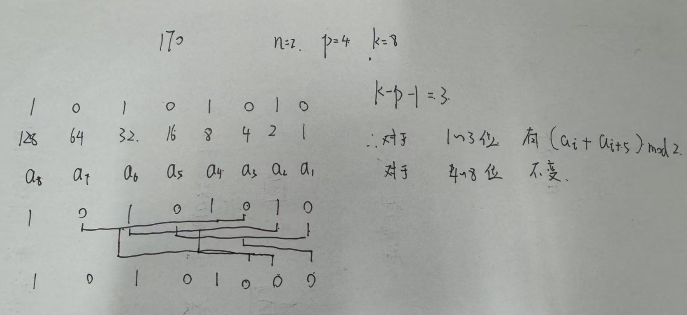
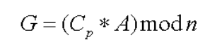
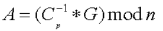
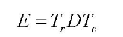
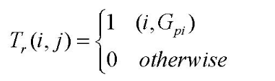
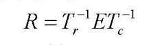

Partial Multimedia Encryption with Different  Security Levels

- 背景
  - 本文提出了一种基于“广义P-格雷码（P-Gray Code）（GPGC）”的新型算法，用于保护国土安全应用中的监控数据。它也被称为 (n, k, p)-格雷码，其中 p 是一个参数，允许用户改变“距离”以生成不同的格雷码序列。将 n（进制）和 p（参数）作为密钥，可提供大量组合，使得加密后的多媒体数据难以破解。实验结果表明，该算法是一种无损方法，且擅长实现局部多媒体加密。该算法计算复杂度低，它也适合实时应用场景。
- 现有问题
- 动机
- 贡献
- 解决思路
  - 提出广义p格雷码将一个数转化为其他进制，再对序列按照一定规则线性计算改变后转化回来进行加密(例如十进制的数转化为了2进制变成了7位，对这七位数进行线性运算后在转化为10进制)
  - 对一维数据（10进制数的集合），按照上述方式生成矩阵（每行对应一个10进制数），然后使用矩阵相乘来获取新的数据，原理相同
  - 对二维数据的加密转化为对行和列的交换交换规则是将原始行号序列通过一维 GPGC加密得到的新序列进行代替
- 具体解决方法
  - 广义P-格雷码（**Generalized P-Gray Code** ，GPGC）
    - 输入(n,k,p)（n代表进制，p代表扰动参数（距离），k代表编码长度）
    - 把一个十进制数 A 转成二进制（n=2）或三进制（n=3），会得到一个 k 位的数列(a~k~,a~k-1~,a~k-2~,a~k-3~,...,a~3~,a~2~,a~1~)
    - 假设A=17，转化为二进制就是(10001),(a₅, a₄, a₃, a₂, a₁) = (1, 0, 0, 0, 1)
    - 
      - 对于最高位K保持不变
      - 对于前k-p-1位，采用加密方法
      - k-p~k位保持不变
      - 
  - 1D-GPGC变化
    - 加密过程
      - 假设将n个要加密的10进制数转化为二进制，保留其中的k位，每一个十进制数表示为二进制矩阵的一行，所以会得到一个n*k大小的矩阵
      - 然后构造一个变化矩阵C,C（k*k）主对角线和j(列)=i(行)+p+1的部分都是1，其余位置为0
      - 
      - 通过矩阵相乘取余来获取加密矩阵
    - 解密过程
      - 
  - 2D-GPGC变化
    - 二维对象来说，使用一维 GPGC 变换会很耗时，因为图像需要一行一行地加密。二维 GPGC 变换比一维 GPGC 更高效，因为它仅需执行一次变换就能加密整个图像。此外，恢复原图时也只需执行一次二维逆变换。
    - 
    - 对于初始的数据，左乘行变化矩阵，右乘列变化矩阵获取加密矩阵
      - 行变化
        - 
        - 根据初始行号[1,2,3,4]根据一维GPGC加密获取新的序列(假设为[3, 1, 4, 2])，对行进行交换用加密后对应的行号代替初始的行号
    - **解密**
      - 
      - 乘以逆矩阵

