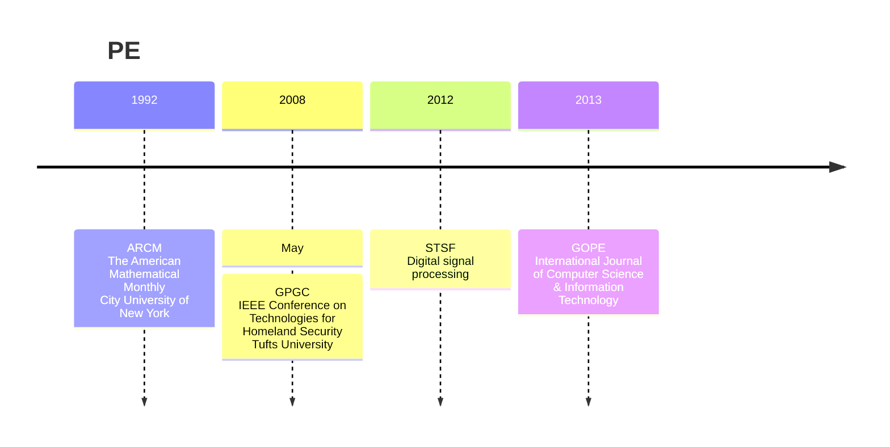
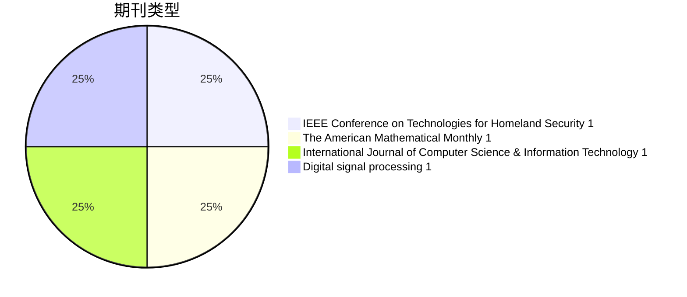
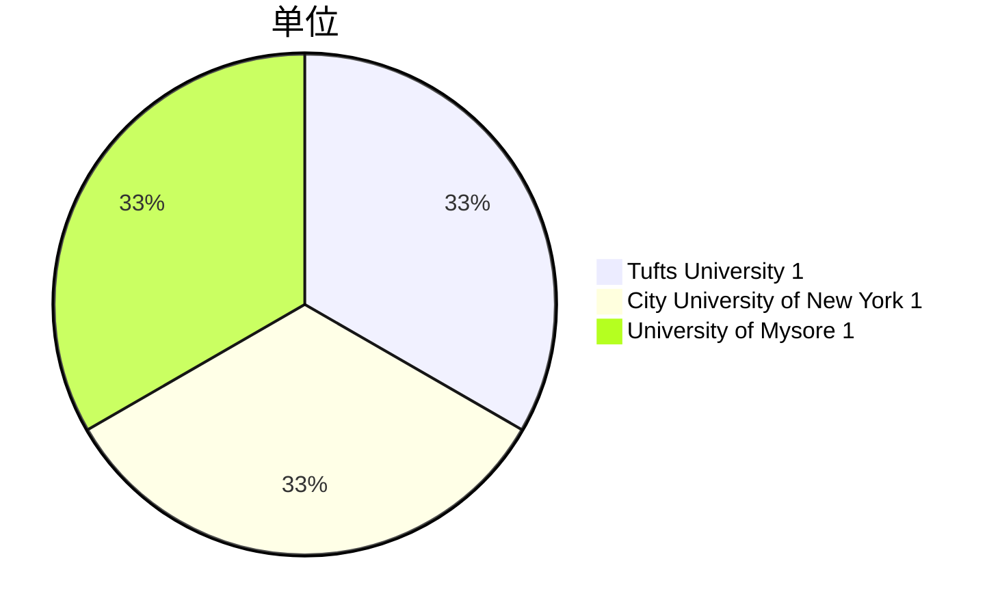
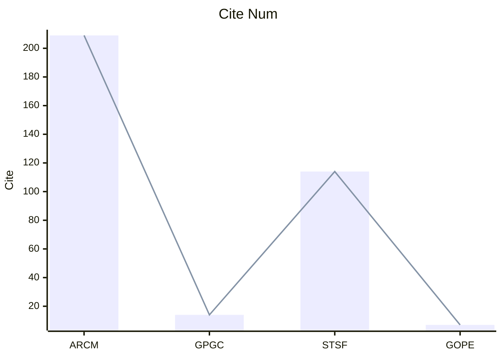

# 1.年份

取arxiv最新版本提交时间与论文截稿时间之间的较早时间

```mermaid
timeline
    title PE
    1992 : ARCM<br>The American Mathematical Monthly<br>City University of New York
    2008 : May
    		 : GPGC<br>IEEE Conference on Technologies for Homeland Security<br>Tufts University
    2012 : STSF<br>Digital signal processing<br>
    2013 : GOPE<br>International Journal of Computer Science & Information Technology<br>
    		 
    
```

# 2. 期刊

```mermaid
pie title 期刊类型
	"IEEE Conference on Technologies for Homeland Security 1" : 1
	"The American Mathematical Monthly 1" : 1
	"International Journal of Computer Science & Information Technology 1" : 1
	"Digital signal processing 1" : 1
```

```mermaid
pie title 单位
	"Tufts University 1" : 1
	"City University of New York 1" : 1
	"University of Mysore 1" : 1
```

# 3. 关联

```mermaid
flowchart BT
```

# 4. 引用量

```mermaid
    xychart-beta
    title "Cite Num"
    x-axis [ARCM,GPGC,STSF,GOPE]
    y-axis "Cite" 
    bar [209,14,114,7]
    line [209,14,114,7]
```

