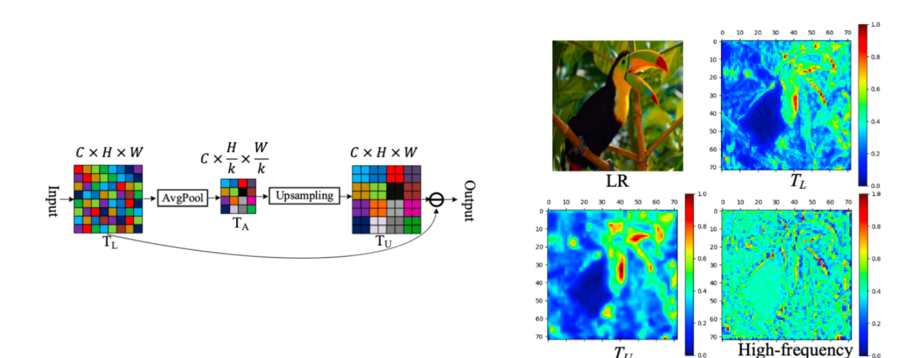

Transformer for Single Image Super-Resolution**. Zhisheng Lu et.al. **arxiv**, **2021**, ([pdf](assets/pdfs/Transformer_for_Single_Image_Super-Resolution.pdf))([link](http://arxiv.org/abs/2108.11084v3)).

- **背景**

  - **相同颜色的框内的图像区域内容相似**，例如多个相似的窗户、重复的纹理结构等。这些相似图像块（patch）之间可以互为“参考”，**一个区域丢失的细节可以由另一个相似区域进行补充或还原**，这就是图像自相似的基本思想。
  - 

- **现有问题**

  - 视觉 Transformer 的**计算开销大、占用显存多**的问题依然严重，限制了其实用性

- **动机**

- **解决思路**

  - **轻量级 CNN 主干（LCB）**
    - **高保留模块(HPB)**
      - **高频滤波模块(HFM)**
        - 提取高频纹理
      - **自适应残差特征块(ARFB)**
        - 增强特征表达与重建能力
  - **轻量级 Transformer 主干（LTB）**
    - **有效变压器(ET)**
      - 仅捕捉局部区域相似图像块之间的相关性
  
- **具体解决办法**

  - **LCB**

    - 分出一路进行下采样，然后用差值算法Resize回x2进行计算，将两种结果拼接，然后用1x1降维+通道注意力
    - 

  - **HFM**

    - 主要流程是先通过平均池化降低图像尺寸，这个特征图代表低频，平滑信息，然后通过双线性差值换源回原始大小，得到的是模糊版的原图，即低频平滑图像，然后进行差分运算（原始输入-生成的低频图像）就是高频信息

    - 

  - **ARFB**

    - 首先经过两个RU模块，模块内是对通道先减半后加倍，引入可学习的参数对这两部分的影响进行调节，然后将结果拼接然后通过1x1卷积进行通道信息融合，然后3x3卷积降低维度
    - 

  - **LTB**

    - 用类似于大小为k卷积核按照stride=1的情况滑动，得到H*W个窗口，对于每个窗口站平成一个一维向量进入ET
    - 

  - **ET(Att:EMHA+Mlp)**

    - 首先将输入的通道减半，染红EMHA使用对大的注意力矩阵进行拆分，拆分成s个小的矩阵进行相乘运算，QKV运算完成后再cat起来，最终将减半的通道数恢复
    - 

/assets/pics/Transformer for Single Image Super-Resolution/image-20250528214315023.png)

==线性结构，提出了新型的网络架构，使用卷积+通道Att，降低通道数，以及注意力图拆分的方式来降低计算量==