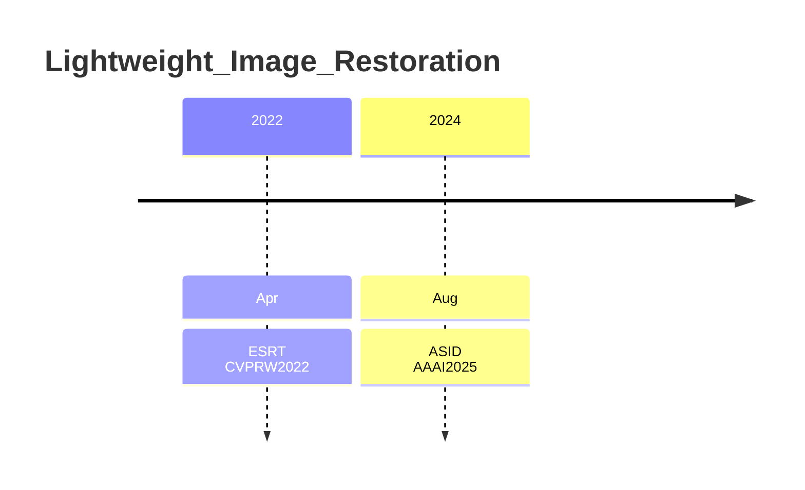
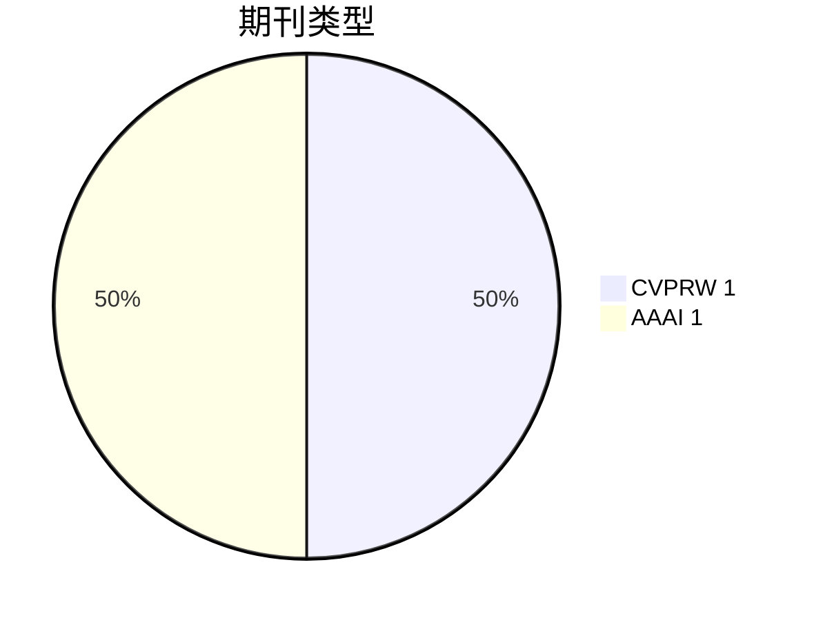
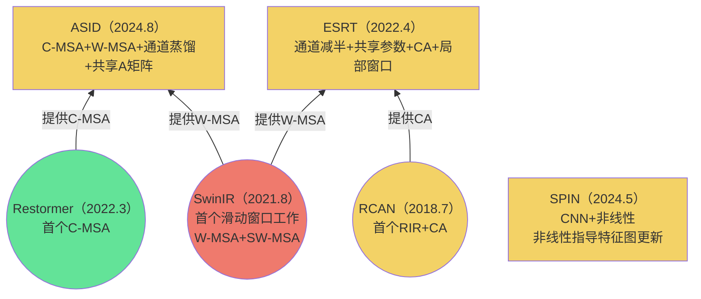
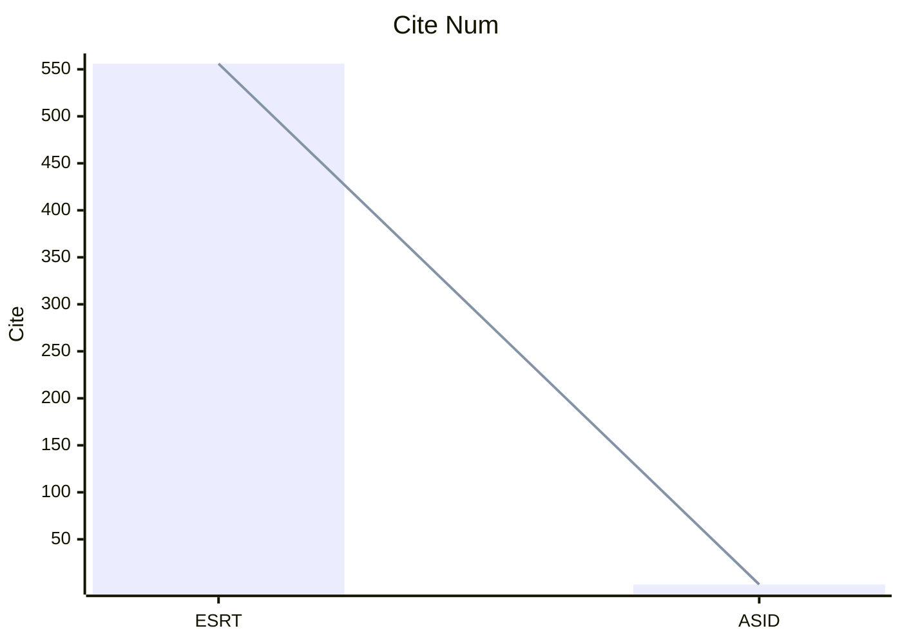

# 1.年份

取arxiv最新版本提交时间与论文截稿时间之间的较早时间

# 2. 期刊

# 3. 关联

- CA:RCAN提出，通道注意力(CNN)
- RIR:RCAN提出，残差中的残差
- C-MSA:Restormer提出通道注意力(Transformer)
- W-MSA:窗口自注意力
- SW-MSA:shift窗口自注意力

---

黄色：超分网络(SR)

绿色：恢复网络(IR)

红色：超分+恢复网络(SR+IR)

----

圆形：关键论文

双括号：值得阅读

**==1. 所有Transformer SR工作都在RIR结构上进行（SPIN）==**

**==2. 所有Transformer IR工作全在U-Net上进行==**

# 4. 引用量

# 5. 实验结果

†代表使用Image_Net预训练

DF2K:DIV2K+Filckr2K

[实验结果](./SR_result.xlsx)