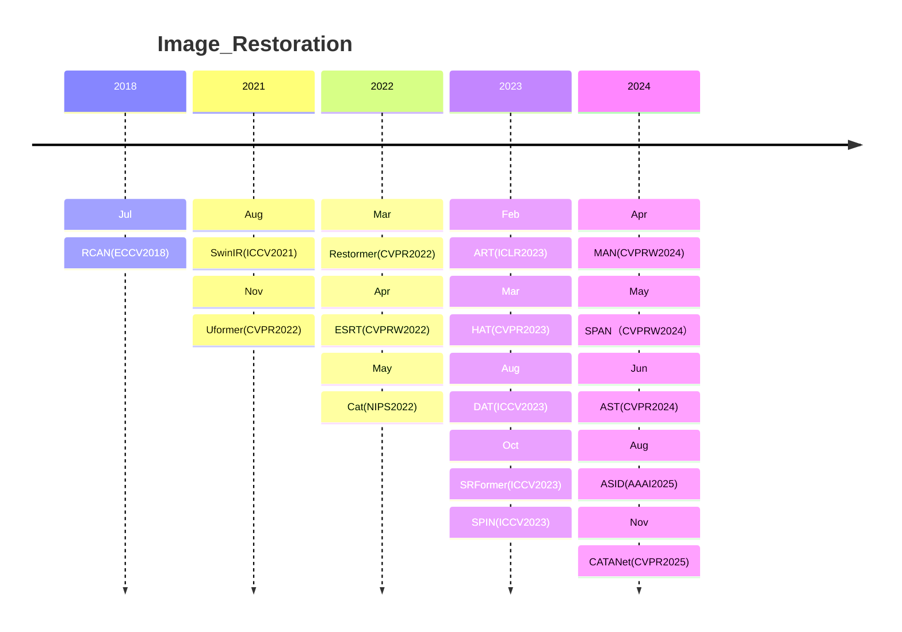
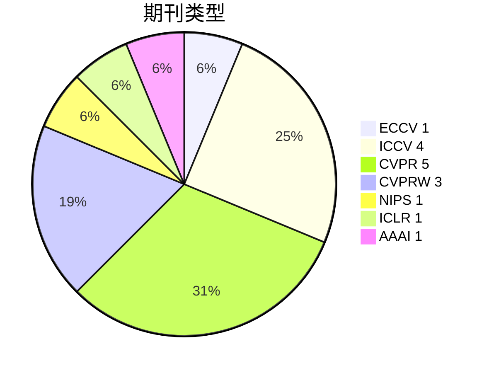
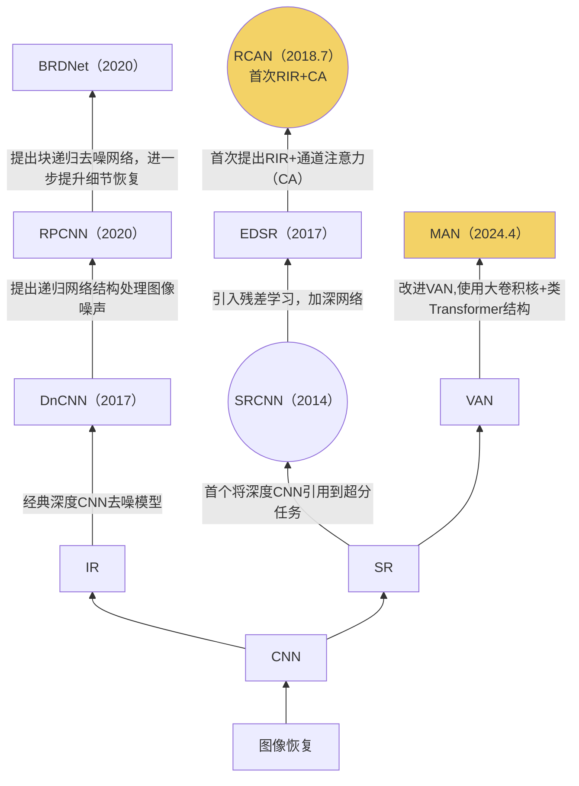
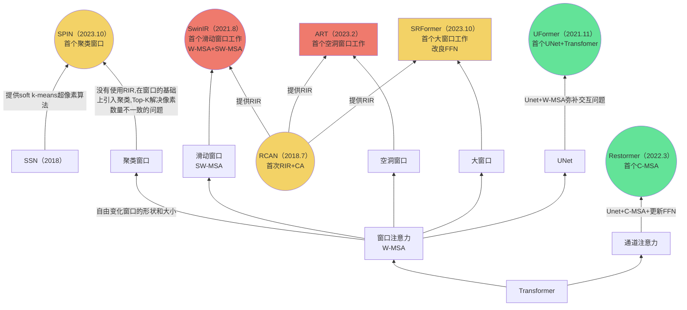
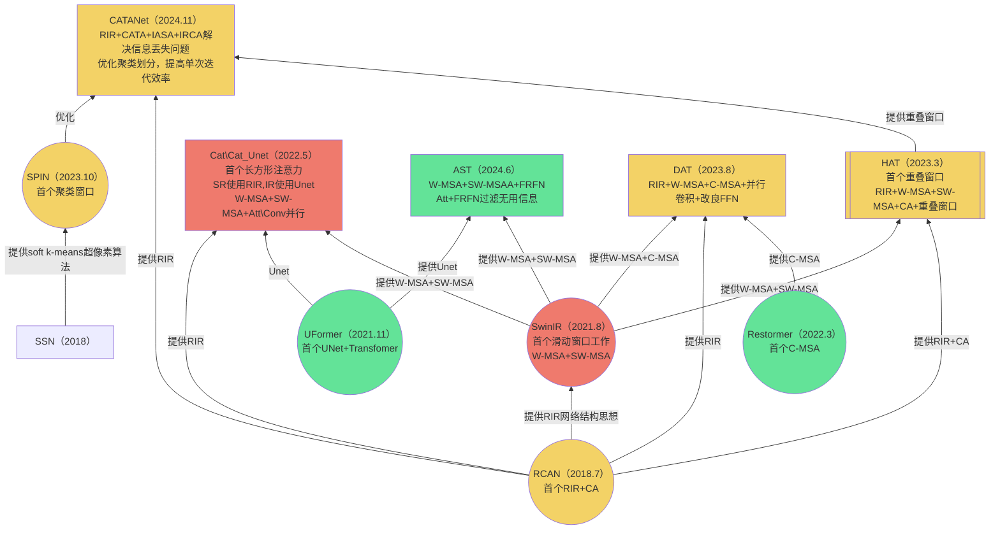
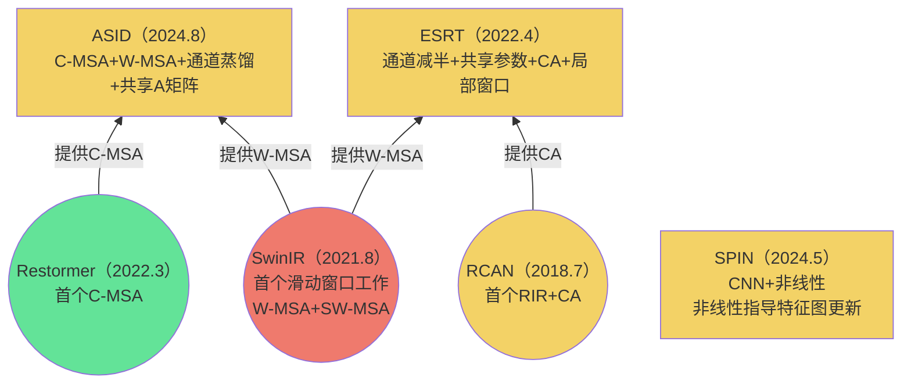
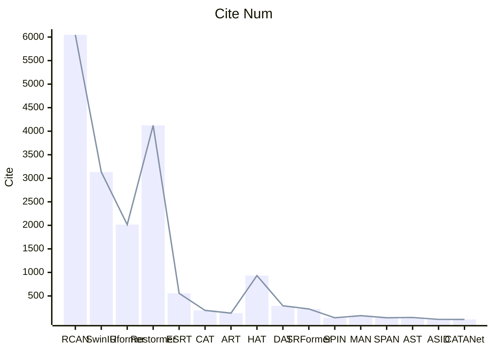
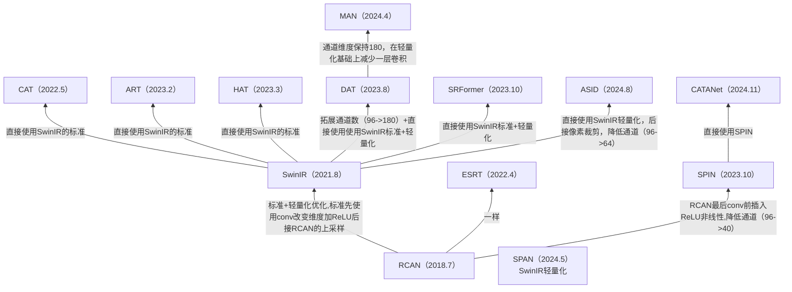

# 1.年份

取arxiv最新版本提交时间与论文截稿时间之间的较早时间

# 2. 期刊

# 3. 关联

- CA:RCAN提出，通道注意力(CNN)
- RIR:RCAN提出，残差中的残差
- C-MSA:Restormer提出通道注意力(Transformer)
- W-MSA:窗口自注意力
- SW-MSA:shift窗口自注意力

---

黄色：超分网络(SR)

绿色：恢复网络(IR)

红色：超分+恢复网络(SR+IR)

----

圆形：关键论文

双括号：值得阅读

## 3.1 CNN

## 3.2 Transformer

## 3.3 轻量化

**==1. 所有Transformer SR工作都在RIR结构上进行（SPIN）==**

**==2. 所有Transformer IR工作全在U-Net上进行==**

# 4. 引用量

# 5. 实验结果

†代表使用Image_Net预训练

DF2K:DIV2K+Filckr2K

[实验结果](./SR_result.xlsx)

# 6. 上采样部分

**==全部采用conv提升通道+PixelShuffle将提升通道扩展到空间==**

效率高、易训练、相比插值算法可学习

Unet结构会使用反卷积来进行层与层的上采样，与这种方式相比又有什么差别？

/assets/pics/analyse/image-20250523165743969.png)

对于高分辨率恢复可不可以使用一半反卷积一半conv+PS？

