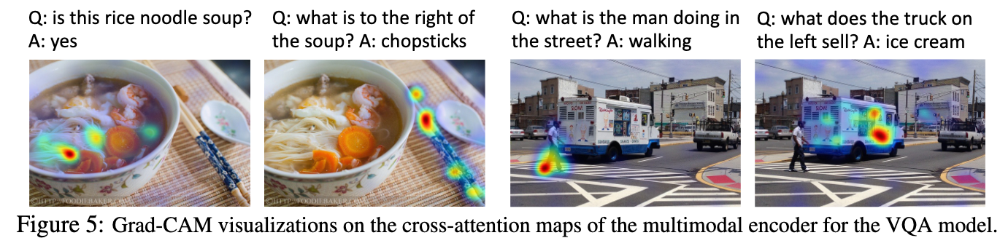
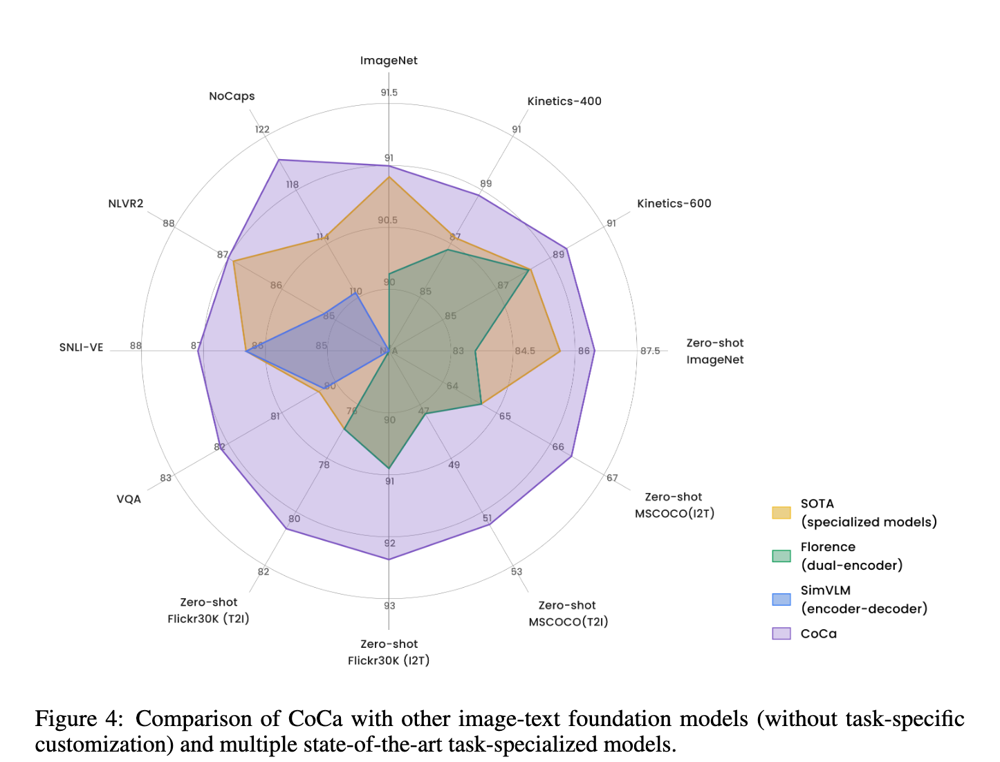

# 1. LAM(生成关注图)

- SRFormer
- /assets/pics/tools/image-20250517221831091.png)
- HAT
- /assets/pics/tools/image-20250517221843587.png)

FD-Conv

- t-SNE对卷积核进行降维可视化

# 2. Grad-CAM（注意力热力图）

ALBEF

# 3. 蜘蛛图

CoCa

