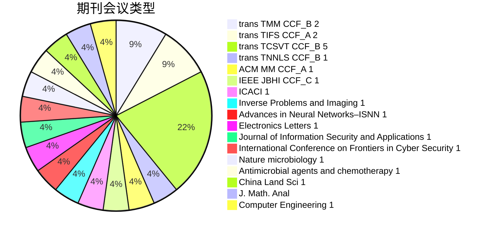
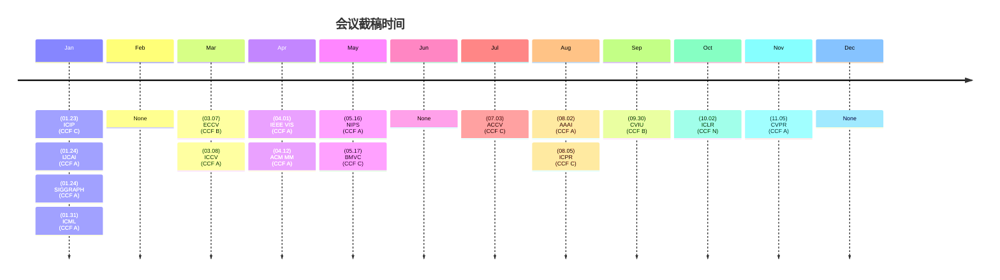

# 1. YY_LX_analyse

# 2. 期刊

- 顶刊
  - TPAMI（公认最好）
  - TIP(逊于)
  - IJCV(和TIP谁是第二有争议)

TIFS

自己的
AI润色的
AI润色的英文的

一句话不超过两到三行，一段文字只讲一个东西。

## 2.1 A类

TPAMI

IJCV

TIP

## 2.2 B类

TMM（相比于TCSVT周期更长，难度含金量更高）

TNNLS（审稿期一年起步）

TCSVT

- 泛cv都收的，可以试试

CVIU

PR

- 审稿周期太长了，看你时间够不够

## 2.3 C类

IET-CVI

IVC

IJPRA

Machine Vision and Applications

PRL

## 2.4 N类

# 3. 会议

- 三大顶会
  - CVPR(每年，6月开会)
  - ICCV(奇数年，10月开会)
  - ECCV(偶数年，3月截稿，9月开会)

## 3.1 A类

ICCV

CVPR

AAAI

- 与IJCAI经常一起评价
- 方差大，中要看脸

IJCAI

ICML

NIPS

ACM MM

siggraph

- 更偏图形学而不是视觉

IEEE VIS

## 3.2 B类

ECCV

CVIU

## 3.3 C类

ACCV

ICPR

BMVC

ICIP

## 3.4 N类

ICLR

