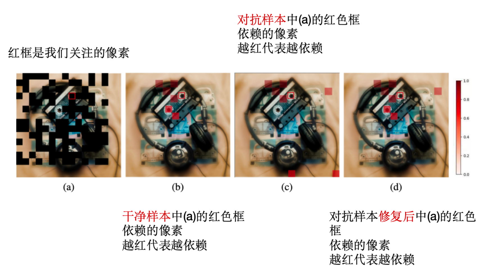
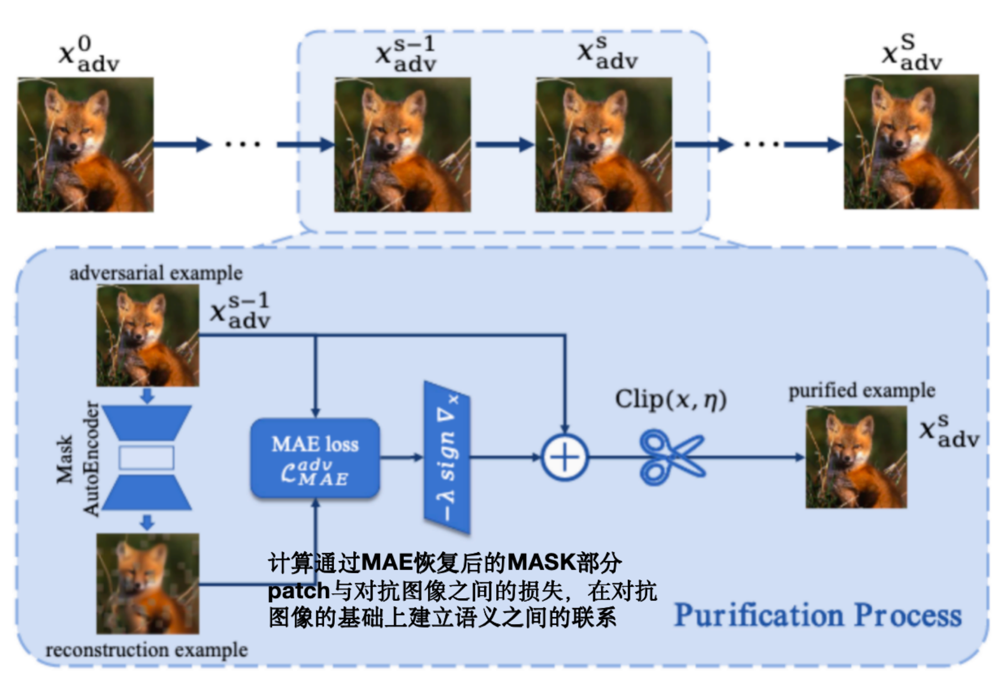

**MAE-Pure: Semantic-Preserving Adversarial Purification**

- **背景**

  - **对抗防御方法**
    - **对抗训练**
      - 训练时主动加入对抗样本使模型学会抵抗这些扰动，提高鲁棒性
      - **局限性**
        - 因为加入对抗样本，可能牺牲在干净样本上的性能
        - 训练过程需要反复生成对抗样本，使得比普通训练好使多
    - **对抗净化**
      - 是在推理阶段对对抗样本进行“清洗”
      - **主流方法**
        - **基于生成模型的净化**
          - 使用扩散模型将带有扰动的对抗样本投影回干净的数据分布
        - **基于适应性的净化**
          - 更侧重于模型对样本的自适应调整，例如通过特征对齐、领域适配等方式使模型降低对对抗扰动的敏感度，相关方法相对较少
      - **提升净化能力的方法**
        - **对比引导**
          - Diffusion models demand contrastive guidance for adversarial purification to advance.
        - **分类器置信度引导**
          - Classifier guidance enhances diffusion-based adversarial purification by preserving predictive information.
        - **引入对抗损失进行微调**
          - Adversarial training on purification (atop): Advancing both robustness and generalization.
      - **目前将MAE用于对抗去噪的方法**
        - **DIR**
          - Eliminating adversarial noise via information discard and robust representation restoration.
          - DIR 方法结合了 MAE 和分类器，并在**对抗训练框架下共同训练**
          - 抛弃部分信息（被 mask 的 patch）利用剩余的 patch 去重建“鲁棒特征”，这样 MAE 学会从未受攻击的区域中恢复干净特征，有助于抑制对抗扰动
        - **DMAE和NIM-MAE**
          - Denoising masked autoencoders help robust classification（DMAE）
          - Beyond pretrained features: noisy image modeling provides adversarial defense.（NIM-MAE）
          - 这两种方法借鉴了去噪自编码器（Denoising Autoencoder）的思想,在图像中加入随机高斯噪声，并要求 MAE 在重建过程中自动滤除这些噪声,主要目标是提升模型在随机噪声下的鲁棒性，并一定程度对抗 adversarial perturbations

- **现有问题**

  - 当前的方法通常采用计算开销很大的扩散模型以获得高质量的还原效果

  - MAE在重建时对对抗噪声非常敏感。这是因为噪声会破坏原始图像中不同patch之间的语义结构，使得重建失败。

    

- **动机**

  - MAE 的重建依赖于语义关系，所以对抗扰动造成的破坏可以通过语义关系的偏移检测到

  - 

  - 弥补对抗净化中未考虑语义结构的破坏的空白

  - 对抗扰动虽然在视觉上微弱，却会破坏图像中 patch 之间的语义关系，而这种关系在 MAE 重建过程中至关重要

  - 

  - 作者提出一种全新的净化视角：并非直接依赖强生成能力，而是通过保持图像 patch 之间的语义关系来进行净化

  - 关注图像内部 patch 之间的语义关系是否受到对抗扰动的破坏

  - MAE-Pure 的创新之处是它不是单纯加噪或对抗训练,而是提出了一个全新的视角观察和优化 MAE 的patch 之间语义关系（即 attention pattern）

- **理论分析**

  - decoder 注意力矩阵变化越大，重建误差下界越高，即使对抗扰动在图像上几乎不可见，一旦扰乱了 decoder 的注意力结构，MAE 的重建能力就会明显下降
  
- **解决思路**

  - **MAE-Pure**
    - 对对抗图像增加一个小扰动，是的注意力矩阵恢复到与干净图一致
    - ==**不是让直接让图像变清晰，而是让patch之间的语义关系恢复正常，也就是说不是让脏图像恢复成原始图像，而是脏图像破坏了语义之间的联系，通过训练在脏图像的基础上建立脏图像中像素的联系**==

  - 测试数据集

    - **小图像数据集**：CIFAR-10、CIFAR-100；
    - **数字图像**：SVHN（街景门牌号）；
    - **大型自然图像**：ImageNet；

- **具体解决方法**

  - **AMV（注意力矩阵变化）**
    - 对抗样本和清晰样本的注意力矩阵差值
  - **核心目标**
    - 
    - 降低对抗图像加扰动和原始图像的距离
  - **问题**
    - 推理阶段拿不到干净图像
    - **解决方法**
      - 用重建损失代替AMV目标
  - 使用PGD来反对抗优化

==对抗样本净化工作，从MAE注意力图的角度分析了对抗样本导致生成模型失效的根本原因是破坏了patch之间的语义关系，本文通过不让对抗样本恢复成干净图像，而是直接在对抗样本的基础上建立patch之间的联系来净化样本==

- MAE-Pure究竟是用于修复MAE面对对抗样本的脆弱性的，还是说作者从MAE这个缺点出发考虑到对抗样本防御的新方向？
  - 作者从MAE这个缺点出发考虑到对抗样本防御的新方向
- 对抗样本能让MAE出现偏差的可能不止patch语义关系混乱这一种，为什么在最终优化的时候无法获取干净图像就用重建损失替代？这是一个单向的推导过程，可能优化好重建损失的本质不是修复语义关系
  - **对于为什么AMV优化能转化成重建损失的解释不足**
- 迁移性问题
  - **每种对抗方法生成的对抗样本可能注意力关注点不同，如何确保有良好的鲁棒性？**