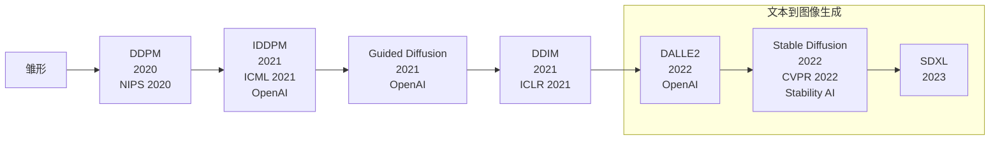

# 1. 发展时间线

```mermaid
flowchart LR
	雏形-->DDPM-->IDDPM-->Guided_Diffusion-->DDIM-->DALLE2
	subgraph 文本到图像生成
	DALLE2-->Stable_Diffusion-->SDXL
	end
	DDPM[DDPM<br>2020<br>NIPS 2020]
	IDDPM[IDDPM<br>2021<br>ICML 2021<br>OpenAI]
	Guided_Diffusion[Guided Diffusion<br>2021<br>OpenAI]
	DDIM[DDIM<br>2021<br>ICLR 2021]
	DALLE2[DALLE2<br>2022<br>OpenAI]
	Stable_Diffusion[Stable Diffusion<br>2022<br>CVPR 2022<br>Stability AI]
	SDXL[SDXL<br>2023]
```

