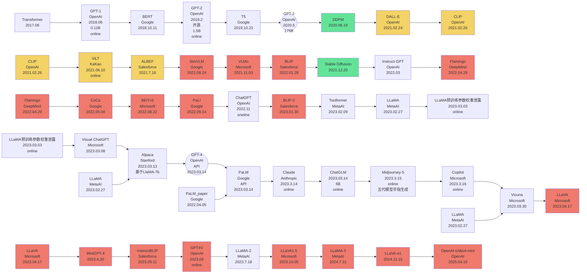
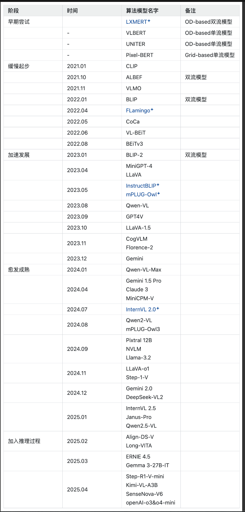

# 1. 发展脉络

取arxiv上的第一版时间

online代表没有找到arxiv上的时间，从别人文章中获取[文章](https://zhuanlan.zhihu.com/p/683834572)

```mermaid
flowchart LR
	Transformer-->GPT-1-->BERT-->GPT-2-->T5-->GPT-3-->DDPM-->DALL-E-->CLIP
	CLIP_1-->ViLT-->ALBEF-->SimVLM-->VLMo-->BLIP-->Stable_Diffusion-->Instruct-GPT-->Flamingo
	Flamingo_1-->CoCa-->BEiTv3-->PaLI-->ChatGPT-->BLIP-2-->Toolformer-->LLaMA-->LLaMA泄露
	LLaMA泄露_1-->Visual_ChatGPT-->Alpaca-->GPT-4-->PaLM-->Claude-->ChatGLM-->Midjourney-->Copilot-->Vicuna-->LLaVA
	LLaMA_1-->Alpaca
	LLaMA_2-->Vicuna
	PaLM_Paper-->PaLM
	LLaVA_1-->MiniGPT-4-->InstructBLIP-->GPT4V-->LLaMA2-->LLaVA1.5-->LLaMA3-->LLaVAo1-->OpenAI-o3&o4-mini
	
	
	
	Transformer[Transformer<br>2017.06]
	GPT-1[GPT-1<br>OpenAI<br>2018.06<br>0.11B<br>online]
	BERT[BERT<br>Google<br>2018.10.11]
	GPT-2[GPT-2<br>OpenAI<br>2019.2<br>开源<br>1.5B<br>online]
	T5[T5<br>Google<br>2019.10.23]
	GPT-3@{ shape: circle, label: "GPT-3<br>OpenAI<br>2020.5<br>175B" }
	DDPM[DDPM<br>2020.06.19]
		style DDPM fill:#63E398
	DALL-E[DALL·E<br>OpenAI<br>2021.02.24]
		style DALL-E fill:#F3D266
	CLIP[CLIP<br>OpenAI<br>2021.02.26]
		style CLIP fill:#F3D266
	CLIP_1[CLIP<br>OpenAI<br>2021.02.26]
		style CLIP_1 fill:#F3D266
	ViLT[ViLT<br>KaKao<br>2021.06.10<br>online]
		style ViLT fill:#F3D266
	ALBEF[ALBEF<br>Salesforce<br>2021.7.16]
		style ALBEF fill:#F3D266
	SimVLM[SimVLM<br>Google<br>2021.08.24]
		style SimVLM fill:#EF7A6D
	VLMo[VLMo<br>Microsoft<br>2021.11.03]
		style VLMo fill:#EF7A6D
	Stable_Diffusion[Stable Diffusion<br>2021.12.20]
		style Stable_Diffusion fill:#63E398
	BLIP[BLIP<br>Salesforce<br>2022.01.28]
		style BLIP fill:#EF7A6D
	Instruct-GPT[Instruct-GPT<br>OpenAI<br>2022.03]
	Flamingo[Flamingo<br>DeepMind<br>2022.04.29]
		style Flamingo fill:#EF7A6D
	Flamingo_1[Flamingo<br>DeepMind<br>2022.04.29]
		style Flamingo_1 fill:#EF7A6D
	CoCa[CoCa<br>Google<br>2022.05.04]
		style CoCa fill:#EF7A6D
	BEiTv3[BEiTv3<br>Microsoft<br>2022.08.22]
		style BEiTv3 fill:#EF7A6D
	PaLI[PaLI<br>Google<br>2022.09.14]
		style PaLI fill:#EF7A6D
	ChatGPT[ChatGPT<br>OpenAI<br>2022.11<br>oneline]
	BLIP-2[BLIP-2<br>Salesforce<br>2023.01.30]
		style BLIP-2 fill:#EF7A6D
	Toolformer[Toolformer<br>MetaAI<br>2023.02.09]
	LLaMA[LLaMA<br>MetaAI<br>2023.02.27]
	LLaMA_1[LLaMA<br>MetaAI<br>2023.02.27]
	LLaMA_2[LLaMA<br>MetaAI<br>2023.02.27]
	LLaMA泄露[LLaMA预训练参数权重泄露<br>2023.03.03<br>online]
	LLaMA泄露_1[LLaMA预训练参数权重泄露<br>2023.03.03<br>online]
	Visual_ChatGPT[Visual ChatGPT<br>Microsoft<br>2023.03.08]
	Alpaca[Alpaca<br>Stanford<br>2023.03.13<br>基于LlaMA-7b]
	GPT-4@{ shape: circle, label: "GPT-4<br>OpenAI<br>API<br>2023.03.14" }
	PaLM[PaLM<br>Google<br>API<br>2023.03.14<online>]
	PaLM_Paper[PaLM_paper<br>Google<br>2022.04.05]
	Claude[Claude<br>Anthropic<br>2023.3.14<br>online]
	ChatGLM[ChatGLM<br>2023.03.14<br>6B<br>online]
	Midjourney[Midjourney-5<br>2023.3.15<br>online<br>五代模型手指生成]
	Copilot[Copilot<br>Microsoft<br>2023.3.16<br>online]
	Vicuna[Vicuna<br>Microsoft<br>2023.03.30]
	LLaVA[LLaVA<br>Microsoft<br>2023.04.17]
		style LLaVA fill:#EF7A6D
	LLaVA_1[LLaVA<br>Microsoft<br>2023.04.17]
		style LLaVA_1 fill:#EF7A6D
	MiniGPT-4[MiniGPT-4<br>2023.4.20]
		style MiniGPT-4 fill:#EF7A6D
	InstructBLIP[InstructBLIP<br>Salesforce<br>2023.05.11]
		style InstructBLIP fill:#EF7A6D
	GPT4V[GPT4V<br>OpenAI<br>2023.09<br>online]
		style GPT4V fill:#EF7A6D
	LLaMA2[LLaMA-2<br>MetaAI<br>2023.7.18]
	LLaVA1.5[LLaVA1.5<br>Microsoft<br>2023.10.05]
		style LLaVA1.5 fill:#EF7A6D
	LLaMA3[LLaMA-3<br>MetaAI<br>2024.7.31]
		style LLaMA3 fill:#EF7A6D
	LLaVAo1[LLaVA-o1<br>2024.11.15]
		style LLaVAo1 fill:#EF7A6D
	OpenAI-o3&o4-mini[OpenAI-o3&o4-mini<br>OpenAI<br>2025.04.16]
		style OpenAI-o3&o4-mini fill:#EF7A6D
```

