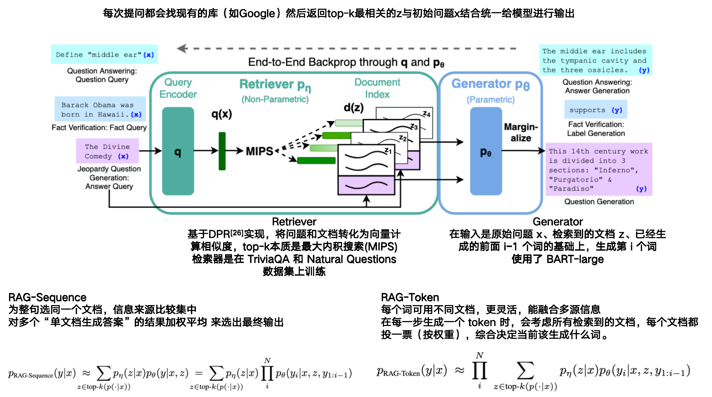

### 1. Retrieval-Augmented Generation for Knowledge-Intensive NLP Tasks

- **RAG**

- **作者: Patrick Lewis†、Ethan Perez、Aleksandra Piktus、Fabio Petroni、Vladimir Karpukhin、Naman Goyal、Heinrich Küttler、Mike Lewis、Wen-tau Yih、Tim Rocktäschel、Sebastian Riedel、Douwe Kiela**

- **Facebook AI Research、University College London、New York University**

- **NIPS:2020**

- **初版提交: 2020.05.22**

- **Cite: 9662**

- **创新点:** 

  **==1.提出了LLM生成时结合搜索引擎的方法==**

  **==2.提出了两种不同的生成策略==**

- 

- [详细信息](./Retrieval-Augmented Generation for Knowledge-Intensive NLP Tasks.md)