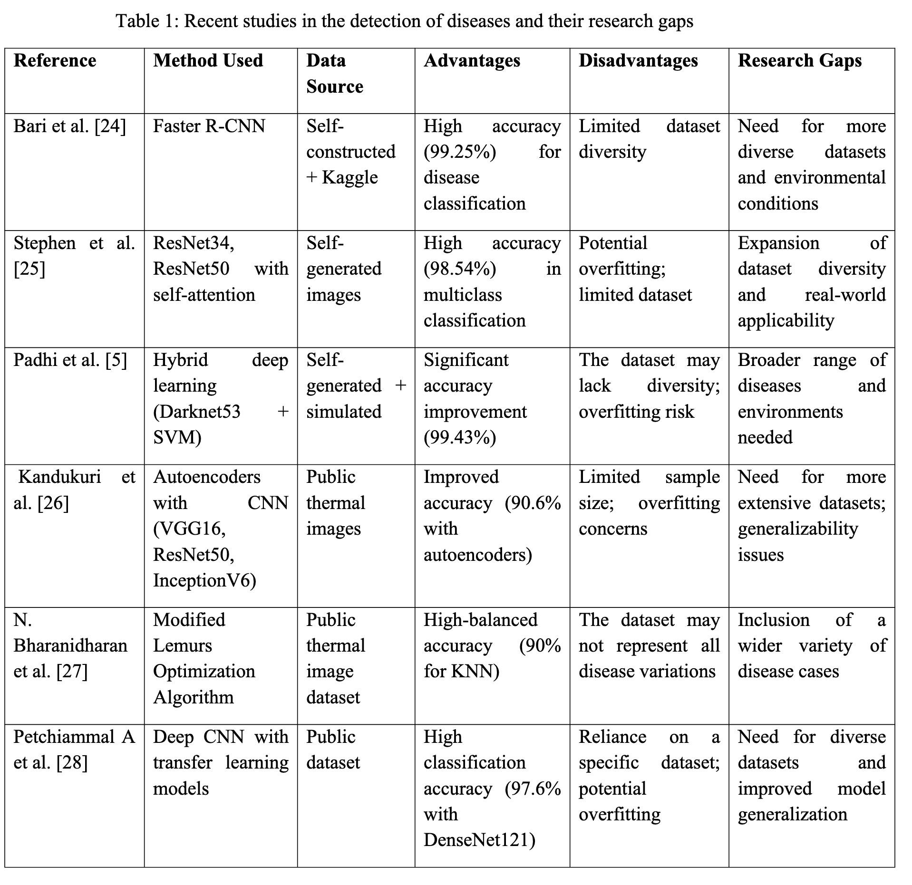

**Adaptive Variant Connectivity with Novel Circadian Rhythms Meta-Heuristic  Loss Functions in GANs with Identity Blocks for Enhanced Thermal Image  Augmentation**

- **背景**

  - 热成像在精准农业中的重要性，尤其是在水稻健康监测方面：
    - 热成像通过捕捉植物表面红外辐射，反映温度变化，这些变化与植物生理状况相关。
    - 健康的稻叶通常表现为温度分布均匀；而病叶由于蒸腾作用减弱或代谢异常，常出现局部温度异常。
    - 比如，稻瘟病、白叶枯病等会导致局部热应激，热成像可用于早期检测。
    - 这种能力对及时采取干预措施、减少损失、提高产量具有重要意义。
  - 传统依赖人工目视检查的方法主观性强，易受人为误差影响。
  - 随着图像分析与机器学习技术发展，出现了自动化检测系统，通过训练图像分类模型，能根据视觉特征区分健康与病叶。
  - 这类系统显著减少检测所需时间与人力，提高了农作物管理效率。
  - 
  - 所有研究都面临 **数据多样性不足、泛化性有限、过拟合风险** 等问题

- **现有问题**

  - 可用的数据集通常较小，缺乏足够样本来训练鲁棒模型。
  - 数据集中的病害分布可能与现实情况不符，导致模型学习出现偏差，泛化能力差。
  - 例如，若数据集主要来自某一地区、某一病害类型，模型就难以适应其他地区或病害。
  - 数据多样性不足会限制模型学习能力。
  - 为解决这些问题，数据增强（如旋转、缩放、翻转等）非常必要，能扩充数据集，提升模型对真实场景中多样性和变化的适应能力。
    - 这部分说明了生成对抗网络（GAN）在数据增强中的作用：
      - GAN 由生成器和判别器组成，通过对抗训练生成高质量、接近真实的合成图像。
      - 在稻叶图像场景下，GAN 可生成多样化的热成像稻叶图像，反映不同健康状态。
      - 这种基于 GAN 的数据增强能扩充训练数据，有助于显著提高病害检测模型的准确性与可靠性。
    - 这部分指出了 GAN 在应用中的挑战：
      - **模式崩溃（mode collapse）**：生成器输出多样性不足，导致生成数据代表性差，影响模型性能。
      - **像素完整性问题**：合成图像可能引入伪影、不真实的纹理或颜色，干扰下游病害检测模型。
      - **缺失像素**：生成图像中若存在大量缺失像素，会降低图像质量，影响训练价值。
      - 研究空白主要集中在 **像素完整性、缺失像素处理、跨帧一致性、模型高效性** 等方面
  - **数据集问题**
    - 

- **动机**

  - 为解决热成像稻叶病害检测中的数据缺失、图像伪影、热对比度低等挑战，提出了一种新型生成式框架（AVC-GAN）
  - **AVC 模块**：根据局部特征动态调整像素连接性，减少伪影，保持像素结构完整性。
  - **新型损失函数**：模仿松果体维持昼夜节律的调节功能，引入时间一致性和空间一致性约束，训练过程中动态调整，提高生成图像质量与多样性。

- **贡献**

  - **提出松果体启发式损失函数**

    强调时序一致性与空间连贯性，提升图像质量与检测模型表现。

    不仅强调空间一致性，还引入时间一致性，使生成图像更真实地反映数据中自然变化。

    传统方法多只关注空间特征；该方法结合时间维度，可根据 GAN 训练性能实时调整。

    同时评估空间和时间维度的连贯性，减少伪影或不一致，而传统方法可能仅关注单帧像素关系。

    结合昼夜节律调节与像素连接性，更精准地填充缺失像素，保持病叶与健康叶的自然差异。

    提供连续反馈机制，增强训练时对空间与时间维度的自适应调整，提高对模式崩溃与缺失像素问题的鲁棒性。

    

  - **提出像素连接性自适应调整方法（AVC）**

    根据局部图像特征动态建模像素关联，有效保留像素结构，减少伪影。

    - 根据局部热梯度和叶片形态特征，动态调整像素间连接权重，比固定邻域方法更好地保留特征，特别适用于识别早期病害中微弱的温度变化。

  - **解决 GAN 的典型问题**

    如模式崩溃（mode collapse）与像素失真，提高合成图像的多样性与真实性。

  - **专注于稻叶热成像增强**

    增加样本数量与多样性，为机器学习模型提供更有效的训练数据。

  - **提高病害检测准确率**

    通过高保真图像增强，提高对健康与病害稻叶的分类性能。

- **解决思路**

  - **Adaptive Variant Connectivity (AVC) 模块**
    - 根据局部热梯度和叶片形态特征，动态调整像素间连接权重，比固定邻域方法更好地保留特征，特别适用于识别早期病害中微弱的温度变化。
  - **生物启发的元启发式损失函数**
    - 借鉴松果体调节昼夜节律机制，引入时间-空间一致性约束，引导 GAN 保持生成图像的一致性与热图特征。
  - **多尺度身份块（multi-scale identity blocks）**
    - **GAN 结构**：引入 identity blocks，改善梯度流动，增强热特征提取能力，确保在训练过程中保留重要的热模式信息。

- **具体解决方法**

  - 数据集采集

    - 使用 FLIR E8 热像仪采集 320×240 分辨率稻叶热图像，总计 636 张，分为五种病害类别（如白叶枯病、稻瘟病等）及健康叶片。

      - **类别不平衡**：如白叶枯病样本 220 张（34.6%），而叶折虫类仅 34 张（5.3%），易导致模型偏向多数类。
      - **样本量少**：总样本有限，不利于深度学习模型训练，尤其对 GAN 来说更难学到丰富的热特征。
      - **时间多样性不足**：采集时段单一，影响模型泛化到不同时间、季节变化情境。
      - **地理多样性不足**：可能来自同一区域，难以泛化到不同气候区和稻种。
      - **病害阶段信息缺失**：缺少病害进程数据，影响早期病害检测能力。

    - 提出 AVC-Pineal GAN 框架，结合特殊增强技术和松果体启发机制，扩大有效数据集规模并保持热图像完整性与时间一致性。

    - 

      