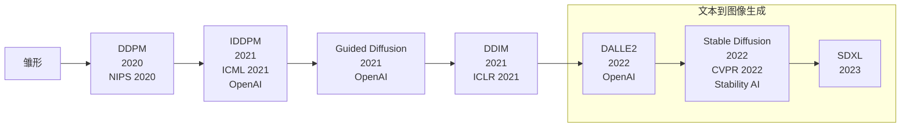
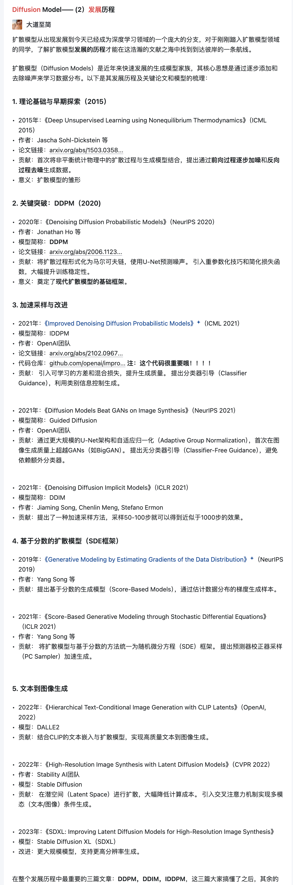

# 1. 发展时间线

绿色和VAE更相关

黄色Diffusion

红色重要的

```mermaid
flowchart LR
VAE-->Diffusion_Model-->VQ-VAE-->VQ-VAE2-->I-GPT-->DDPM-->DDIM-->Imporved_DDPM-->DALL-E
DALL-E_2-->Diffusion_Beat_GANs-->CogView-->GLIDE-->LDM-->DALL-E2-->CogView2-->Imagen
Imagen_1_1-->Stable_Diffusion2-->DiTs-->SDXL-->DALL-E3-->SDXL_Turbo-->Imagen_2-->SD3-->CogView3
VAE[VAE<br>2013.12.20]
style VAE fill:#63E398
Diffusion_Model[Diffusion_Model<br>]
style Diffusion_Model fill:#F3D266
VQ-VAE[VQ-VAE<br>Google DeepMind<br>2017.11.02]
style VQ-VAE fill:#63E398
VQ-VAE2[VQ-VAE2<br>Google DeepMind<br>2019.06.02]
style VQ-VAE2 fill:#63E398
I-GPT[I-GPT<br>OpenAI<br>2020.01.31]
DDPM[DDPM<br>UC Berkeley<br>2020.06.19]
style DDPM fill:#F3D266
DDIM[DDIM<br>Stanford University<br>2020.10.06]
style DDIM fill:#F3D266
Imporved_DDPM[Imporved DDPM<br>OpenAI<br>2021.02.18]
style Imporved_DDPM fill:#F3D266
DALL-E[DALL·E<br>OpenAI<br>2021.02.24]
style DALL-E fill:#63E398
DALL-E_2[DALL·E<br>OpenAI<br>2021.02.24]
style DALL-E_2 fill:#F3D266
Diffusion_Beat_GANs[Diffusion Beat GANs<br>OpenAI<br>2021.05.11]
style Diffusion_Beat_GANs fill:#F3D266
CogView[CogView<br>Tsinghua University<br>2021.05.26]
GLIDE[GLIDE<br>OpenAI<br>2021.12.20]
style GLIDE fill:#F3D266
LDM[LDM（Stable_Diffusion）<br>2021.12.20]
style LDM fill:#F3D266
DALL-E2[DALL·E2<br>OpenAI<br>2022.04.13]
style DALL-E2 fill:#F3D266
CogView2[CogView2<br>Tsinghua University<br>2022.04.28]

Imagen[Imagen<br>Google Brain<br>2022.05.28]
style Imagen fill:#F3D266
Imagen_1_1[Imagen<br>Google Brain<br>2022.05.28]
style Imagen_1_1 fill:#F3D266
Stable_Diffusion2[Stable_Diffusion2]
style Stable_Diffusion2 fill:#F3D266
DiTs[DiTs<br>UC Berkeley<br>2022.12.19]
style DiTs fill:#F3D266
SDXL[SDXL<br>Stability AI<br>2023.07.4]
style SDXL fill:#F3D266
DALL-E3[DALL·E3<br>OpenAI<br>]
style DALL-E3 fill:#F3D266
SDXL_Turbo[SDXL Turbo<br>Stability AI]
style SDXL_Turbo fill:#F3D266
Imagen_2[Imagen 2<br><br>]
style Imagen_2 fill:#F3D266
SD3[SD3<br>Stability AI<br>]
style SD3 fill:#F3D266
CogView3[CogView3<br> Tsinghua University<br>2024.03.08]
```

# 2.VAE、GAN和Diffusion的区别

- VAE
  - 从概念一步得出图像
  - 将图像映射到潜在的向量空间，在做图像生成的时候，只需要在向量空间随机采样放入VAE-Decoder就能一步生成图像

- Diffusion
  - 从噪声图像中逐步恢复出图像
  - 将图像映射成噪声，在做图像生成的时候，只需要随机取一个噪声图片放入Diffusion-Decoder，然后通过多步去噪来生成图像
- GAN
  - 在做图像生成的时候，和VAE一样根据随机的向量来生成，生成器负责生成和原图越像的图片越好，判别器同时接受生成图像和原始图片，目标是做出正确判断