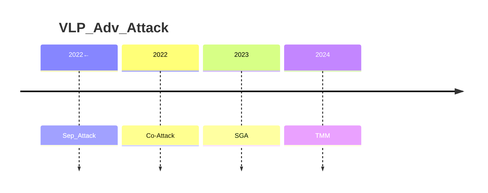
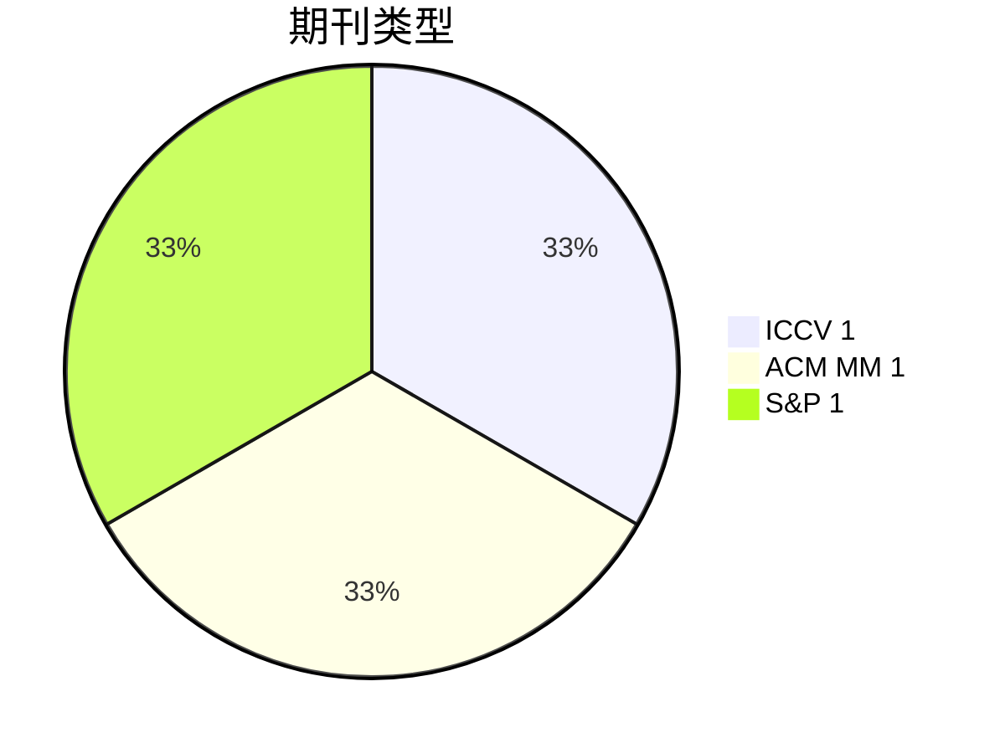
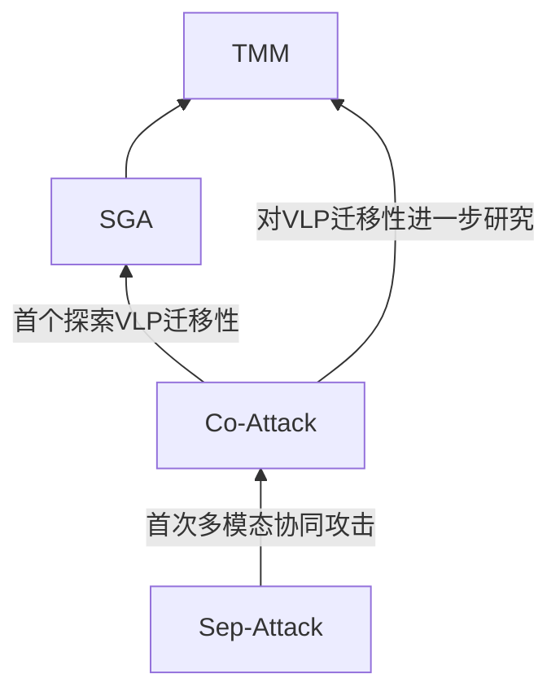
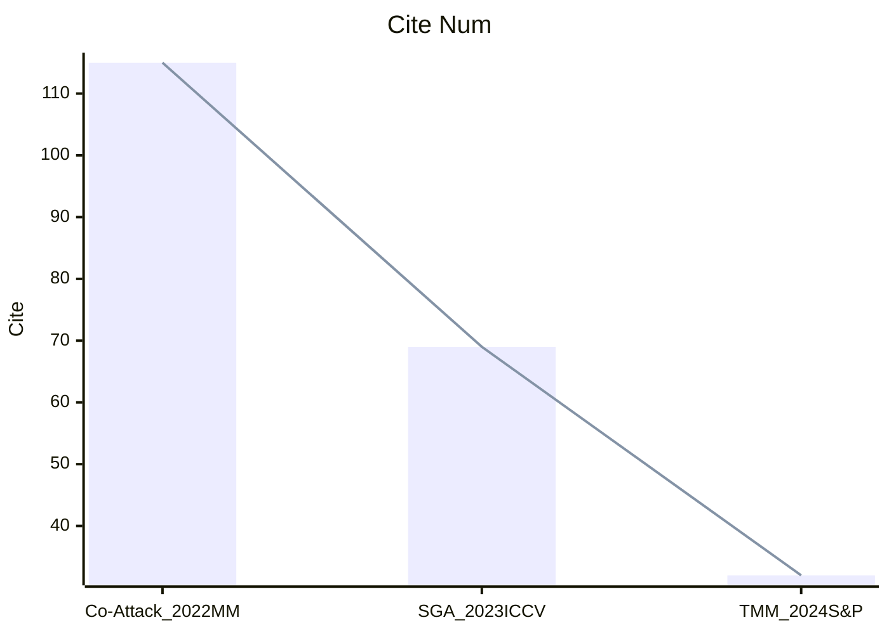
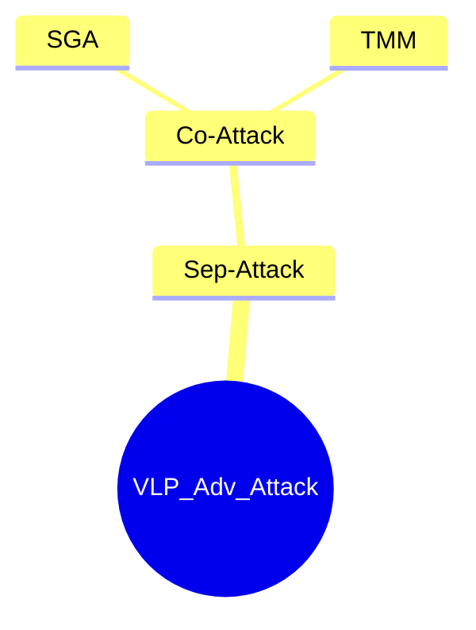

# 1.年份

```mermaid
timeline
    title VLP_Adv_Attack
    2022← : Sep_Attack
    2022 : Co-Attack
    2023 : SGA
    2024 : TMM
```

# 2. 期刊

```mermaid
pie title 期刊类型
    "ICCV 1" : 1
    "ACM MM 1" : 1
    "S&P 1" : 1
```

# 3. 关联

```mermaid
flowchart BT
    A[Sep-Attack]-->|首次多模态协同攻击|B[Co-Attack] -->|首个探索VLP迁移性| C[SGA]-->D
    B-->|对VLP迁移性进一步研究|D[TMM]

```

# 4. 引用量

```mermaid

    xychart-beta
    title "Cite Num"
    x-axis [Co-Attack_2022MM, SGA_2023ICCV, TMM_2024S&P]
    y-axis "Cite" 
    bar [115,69,32]
    line [115,69,32]
```

# 5. 汇总

```mermaid
mindmap
  root((VLP_Adv_Attack))
    Sep-Attack
      Co-Attack
      	SGA
       TMM
    
```

