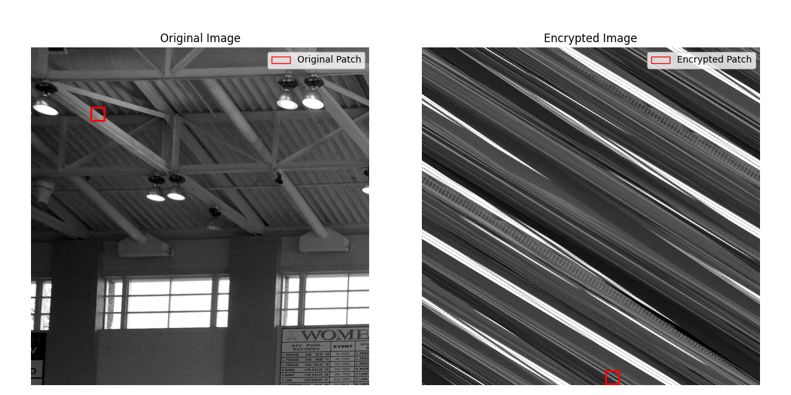
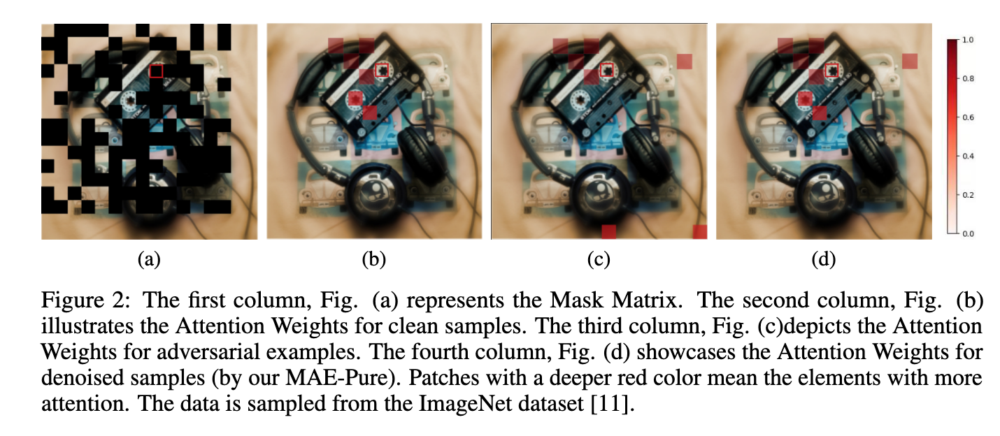

# 自己写的

​	不同于传统的图像恢复，图像的信息破坏程度较低，而且在像素空间上的位置没有改变。因此现有的图像恢复网络只需要关注当前像素位置临近像素就可以很好的捕捉到联系，为了降低计算量，现有网络通常使用分块的分块注意力【1】来对图像的小范围局部信息进行处理，这样设计能够保证在信息破坏程度较低的图像中以较小的参数量与运算量取得较好的恢复效果。而感知加密图像会在像素层面将图像视觉信息进行线性运算并重排，这就会导致原本位置对应的视觉信息会在加密的过程中与较远位置的信息建立联系，仅关注当前像素的临近位置就远远不够了。在大尺度图像加密的图像上，现有图像恢复网络的分块注意力无法捕捉到超远距离像素之间的联系，就会导致无法正确的恢复图像的视觉信息【图x 可视化加密】。直觉上我们可以增大局部注意力的关注范围，但是这会导致计算量激增。另一种思路是将大尺度加密图像的特征信息进行提取转化为小尺度图像，然后在小尺度图像上进行特征提取，这样可以保证计算量不大幅增加的基础上让模型捕获到超远距离信息，而将大尺度图像信息提取的下采样模块就尤为重要了。我们采用浓缩大尺度图像特征而不是增大注意力核来实现。

​	直觉一：加密图像恢复需要建立图像朝远距离像素之间的联系，可以使用特征提取或更大的注意力核来实现，而相比于更大的注意力核，合适的特征提取模块所需要的计算量更小，更容易在现实中部署

​	将大尺度的图像关键信息提取为小尺寸图像后，我们还是面临捕获远距离空间特征的问题，传统的Swin思想虽说可以通过滑动窗口来捕获较远距离的空间特征，但是这是远远不够的，并且还会出现边界伪影问题。所以我们借鉴了ART【2】的空洞注意力形式，让模型在局部能够捕获信息的同时还能与远距离信息建立联系，这有助于重建感知加密图像的视觉信息。我们采用空洞注意力而不是分块+Swin的注意力来构建核心模型。==（现有的）==

​	直觉二：使用传统的Swin注意力还是无法捕获远距离信息，所以需要一种不增加计算量且能捕获远距离信息的注意力网络。

​	现有的图像恢复以及超分辨率网络往往更加关注核心网络的设计，而忽略了图像特征提取的部分，绝大多数工作只使用简单的特征提取模块（3x3卷积）和图像重建模块（卷积+pixshuffle），而这部分是最直接与原始图像和恢复图像建立联系的模块，所以有一个更好的特征提取模块和图像重建模块能够更有效的提取和恢复图像中的信息。我们通过精心设计的特征提取模块和图像重建模块来代替传统的网络结构。

​	直觉三：更好的特征提取和图像重建模块能够显著提高图像的信息捕捉和图像重建能力，而现有网络醉心于注意力机制的创新而没有关注到这一点。

## 图x

## 作图借鉴

## 撰写风格借鉴

[1]SwinIR: Image restoration using swin transformer

> SwinIR
>
> 2021

[2] Accurate image restoration with attention retractable transformer

> ART
>
> 2023

