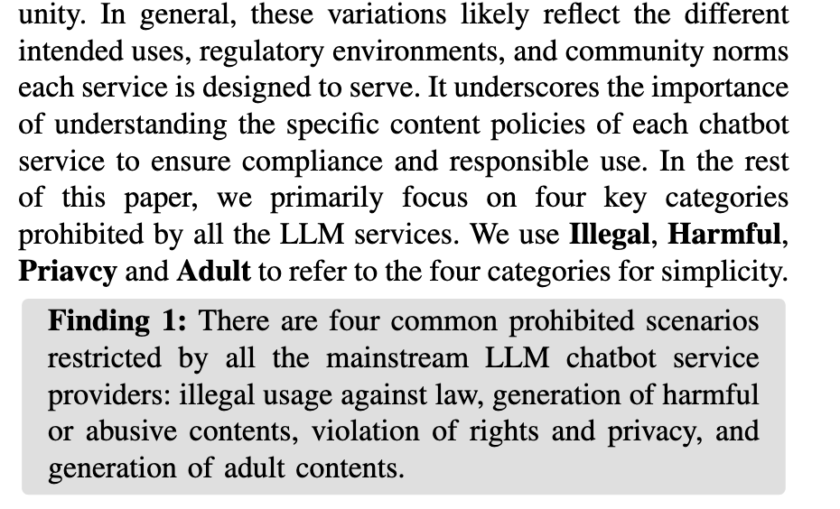

# 自己写的

​	不同于传统的图像恢复，图像的信息破坏程度较低，而且在像素空间上的位置没有改变。因此现有的图像恢复网络只需要关注当前像素位置临近像素就可以很好的捕捉到联系，为了降低计算量，现有网络通常使用分块的分块注意力【1】来对图像的小范围局部信息进行处理，这样设计能够保证在信息破坏程度较低的图像中以较小的参数量与运算量取得较好的恢复效果。而感知加密图像会在像素层面将图像视觉信息进行线性运算并重排，这就会导致原本位置对应的视觉信息会在加密的过程中与较远位置的信息建立联系，仅关注当前像素的临近位置就远远不够了。在大尺度图像加密的图像上，现有图像恢复网络的分块注意力无法捕捉到超远距离像素之间的联系，就会导致无法正确的恢复图像的视觉信息【图一】。直觉上我们可以增大局部注意力的关注范围，但是这会导致计算量激增。另一种思路是将大尺度加密图像的特征信息进行提取转化为小尺度图像，然后在小尺度图像上进行特征提取，这样可以保证计算量不大幅增加的基础上让模型捕获到超远距离信息，而将大尺度图像信息提取的下采样模块就尤为重要了。我们采用浓缩大尺度图像特征而不是增大注意力核来实现。

​	直觉一：由于大尺度加密图像会大幅破坏初始图像的视觉信息，所以在恢复的过程中需要建立超远距离的像素联系。而使用更大的注意力核会导致计算量激增，所以可以采用对大尺度图像信息提取来获取小尺度的图像关键信息，再使用标准的注意力核进行提取，这样可以在保证恢复质量的基础上维持较低的计算量。

​	将大尺度的图像关键信息提取为小尺寸图像后，我们还是面临捕获远距离空间特征的问题，传统的Swin思想虽说可以通过滑动窗口来捕获较远距离的空间特征，但是这是远远不够的，并且还会出现边界伪影问题。所以我们借鉴了ART【2】的空洞注意力形式，让模型在局部能够捕获信息的同时还能与远距离信息建立联系，这有助于重建感知加密图像的视觉信息。我们采用空洞注意力而不是分块+Swin的注意力来构建核心模型。

​	直觉二：使用传统的Swin注意力还是无法捕获远距离信息，所以需要一种不增加计算量且能捕获远距离信息的注意力网络。

​	现有的图像恢复以及超分辨率网络往往更加关注核心网络的设计，而忽略了图像特征提取的部分，绝大多数工作只使用简单的特征提取模块（3x3卷积）和图像重建模块（卷积+pixshuffle），而这部分是最直接与原始图像和恢复图像建立联系的模块，所以有一个更好的特征提取模块和图像重建模块能够更有效的提取和恢复图像中的信息。我们通过精心设计的特征提取模块和图像重建模块来代替传统的网络结构。

​	直觉三：更好的特征提取和图像重建模块能够显著提高图像的信息捕捉和图像重建能力，而现有网络醉心于注意力机制的创新而没有关注到这一点。

# GPT润色

​	与传统图像恢复任务不同，感知加密图像在信息破坏强度和像素空间结构上均发生了显著变化。一般而言，传统图像退化方式（如高斯噪声、轻度模糊）保留了像素的空间结构，因此图像恢复网络只需关注局部像素邻域即可实现有效建模。为降低计算成本，现有方法普遍采用分块注意力机制【1】，专注于图像局部区域的信息交互，以较小的参数量和计算开销实现良好的恢复效果。

​	然而，感知加密过程通过对图像的像素信息进行线性变换与空间重排，使得原始图像中局部对应的视觉信息在加密图像中被打散至远距离区域，局部建模能力已无法胜任重构任务。在大尺度感知加密图像中，这种非局部依赖特性更加明显，现有基于局部分块注意力的图像恢复方法难以捕捉超长距离的像素依赖关系，导致恢复效果不理想【图一】。

​	一种直观的解决方式是扩大注意力窗口，以增强远距离感知能力，但这将导致计算复杂度显著上升。为此，我们采用另一种思路：首先通过设计高效的下采样模块提取大尺度图像的关键特征，将图像压缩至小尺度表示；随后在该小尺度表示上进行远距离建模，从而在不显著增加计算负担的前提下提升恢复性能。这一策略有效缓解了局部注意力感知范围不足的问题。

​	**直觉一**：感知加密严重破坏图像的视觉一致性，恢复过程中需建模超长距离的像素依赖。扩大注意力感受野虽可行但计算开销巨大，因此我们通过信息浓缩下采样策略将大尺度图像映射至小尺度表示，并在该尺度上使用标准注意力机制进行高效建模，从而在保证性能的同时降低计算复杂度。

​	在将图像映射至小尺度后，我们仍面临如何在有限空间内捕获远距离依赖的问题。虽然 Swin Transformer 提出滑动窗口机制以增强窗口间交互，但其远距离建模能力仍受限，且容易引入边界伪影。为此，我们借鉴 ART【2】的空洞注意力设计，采用稀疏而扩展的注意力模式，使模型在保持局部建模能力的同时获得跨窗口的非局部感知能力，有助于更有效地重建被破坏的视觉语义。

​	**直觉二**：Swin 注意力虽能一定程度扩展建模范围，但仍难以充分捕捉感知加密引入的远距离依赖。空洞注意力以不增加计算量的方式实现远距离建模，因而是更为合理的选择。

​	此外，尽管现有图像恢复与超分辨网络广泛关注于注意力模块的设计与优化，但图像特征提取与重建阶段的重要性常被忽视。大多数方法仅采用简单的卷积（如 3×3 卷积）进行特征提取，以及基于像素重排（PixelShuffle）的重建模块，这种设计难以充分挖掘与还原图像的结构信息。鉴于此，我们重新设计了特征提取与图像重建模块，旨在提升感知加密图像中结构和细节信息的提取与还原能力。

​	**直觉三**：相比一味优化注意力机制，构建更强大的图像特征提取与重建模块有望显著提升图像信息捕捉与还原的能力。然而，这一关键点在现有研究中尚未被充分重视。

## 撰写风格借鉴

[1]SwinIR: Image restoration using swin transformer

> SwinIR
>
> 2021

[2] Accurate image restoration with attention retractable transformer

> ART
>
> 2023

