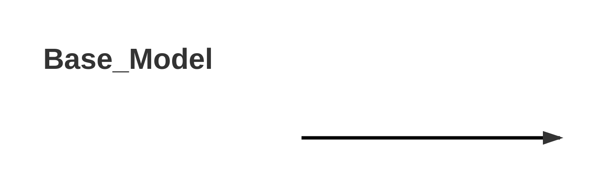

# 1.年份

取arxiv最新版本提交时间与论文截稿时间之间的较早时间




# 2. 期刊


```mermaid
pie title 单位
```


# 3. 关联

```mermaid
flowchart BT
```


# 4. 引用量

```mermaid
    xychart-beta
    title "Cite Num"
    x-axis []
    y-axis "Cite" 
    bar []
    line []
```


