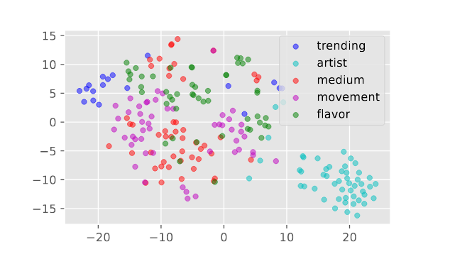
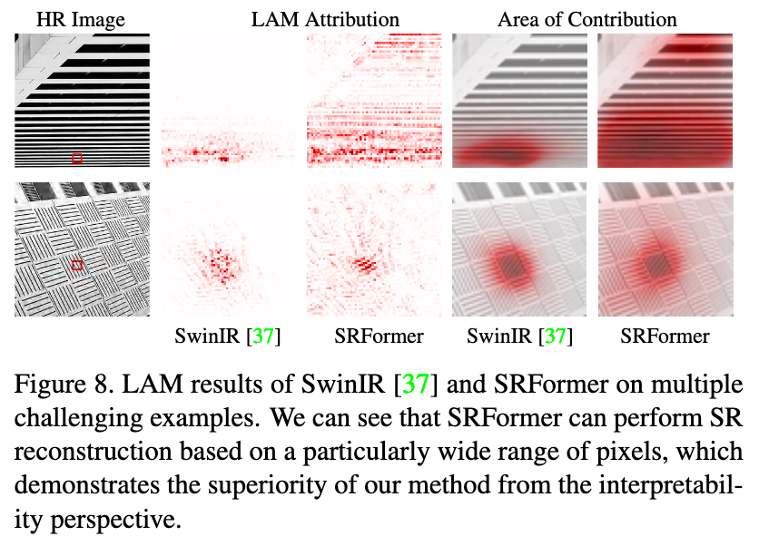
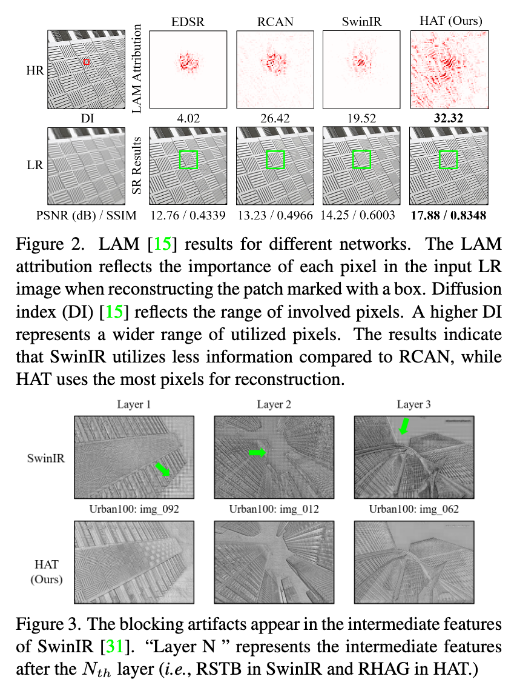
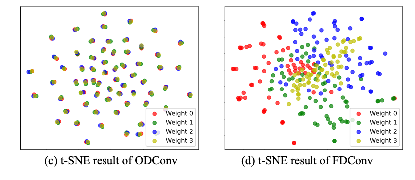
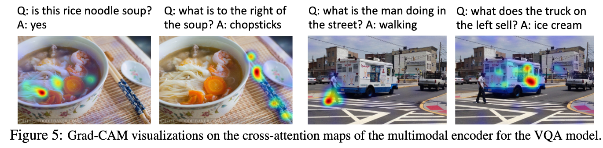
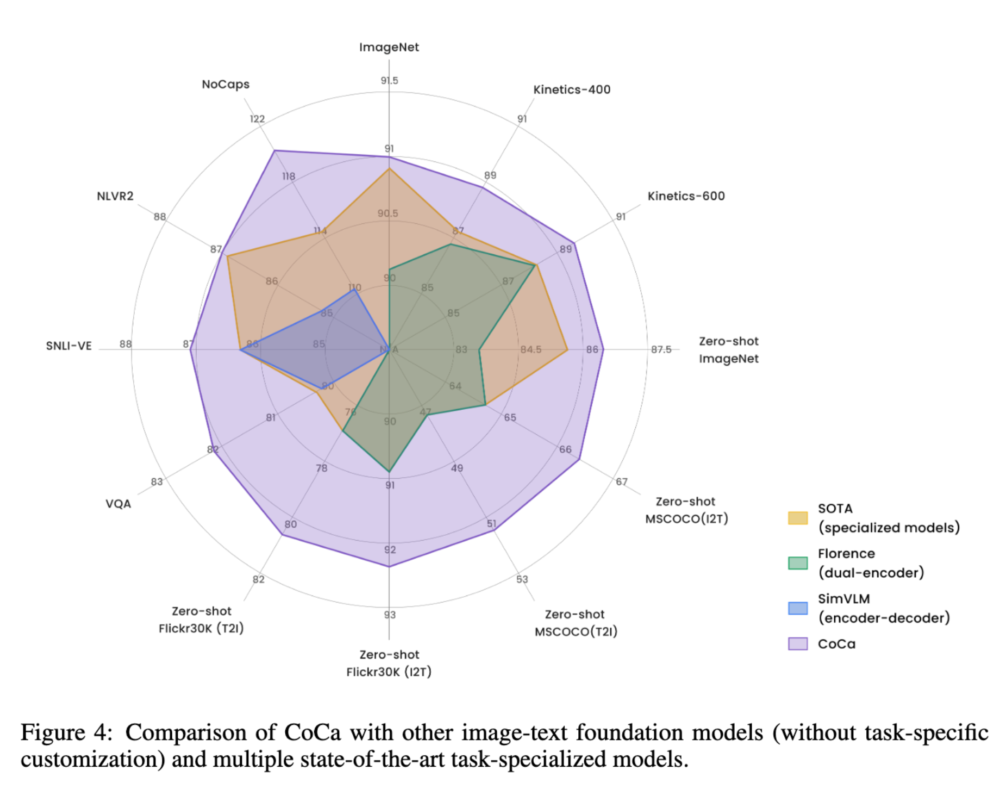

# 1. Lexica(根据Prompt生成图像与相关词)

Lexica 拥有超过 500 万条 prompt 与其生成的图像

https://lexica.art/docs

> Prompt Stealing Attacks Against Text-to-Image Generation Models

## 1.1 API

https://lexica.art/docs

# 2. T-SNE(特征向量可视化)

向量可视化

> Prompt Stealing Attacks Against Text-to-Image Generation Models

# 3. CLIP Interrogator(图像反推修饰词)

根据图像反推修饰词

https://github.com/pharmapsychotic/clip-interrogator

# 4. LAM(生成关注图)

- SRFormer
- 
- HAT
- 

# 5. T-SNE可视化向量

FD-Conv

- t-SNE对卷积核进行降维可视化

# 6. Grad-CAM（注意力热力图）

ALBEF

# 7. 蜘蛛图

CoCa

# 8.EasyOCR(提取文字)

 [https://pypi.org/project/easyocr/1.7.1/,](https://pypi.org/project/easyocr/1.7.1/)

提取图片中文字

# 9.故意越狱Prompt

从 jailbreakchat.com⁴ 这个分享恶意提示的网站中选择了一个强效的恶意指令 AIM3